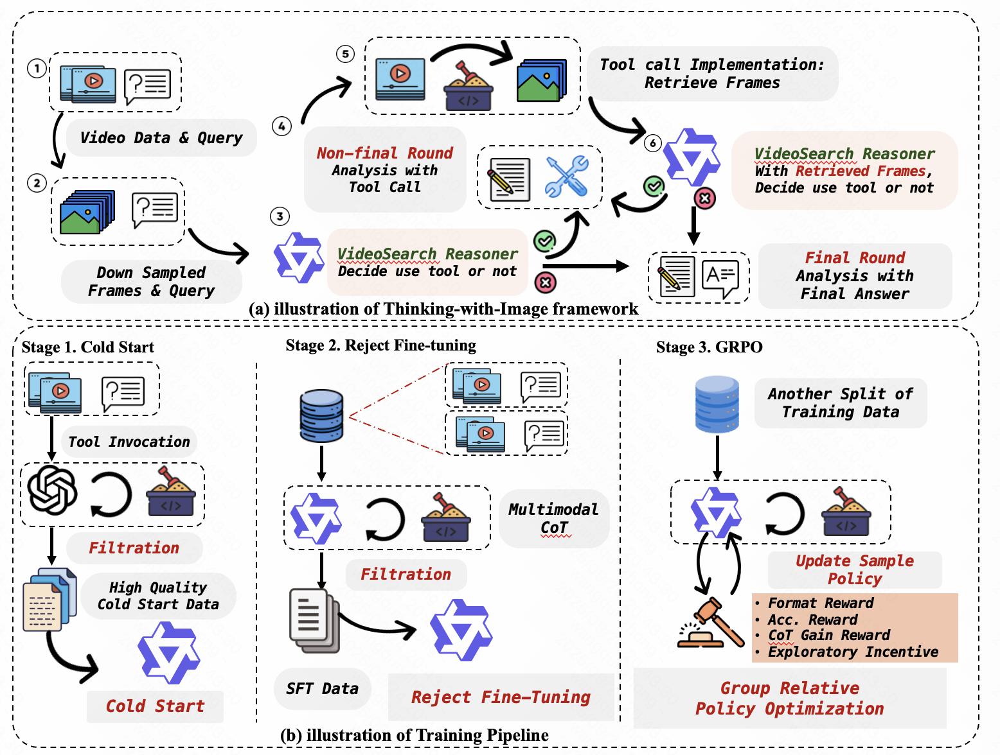
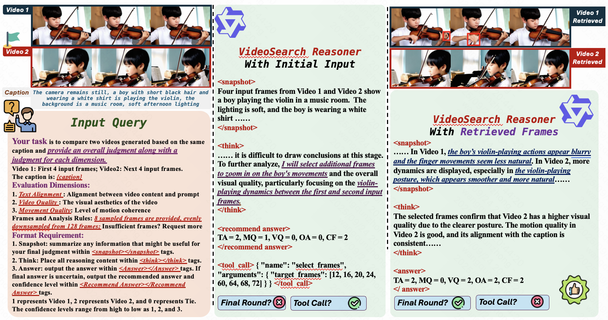

# VideoSearch Reasoner: Boosting Multimodal Reward Models through Thinking-with-Image Reasoning

## Overview




# VideoSearch Reasoner

Recent advancements in multimodal reward models (RMs) have substantially improved post-training for visual generative models. However, current RMs face inherent limitations:

1. **Visual inputs consume large context budgets**, forcing fewer frames and causing loss of fine-grained details
2. **All visual information is packed into the initial prompt**, exacerbating hallucination and forgetting during chain-of-thought reasoning

To overcome these issues, we introduce **VideoSearch Reasoner**, a thinking-with-image framework that equips the RM with visual reasoning operations (e.g., select frame) and a configurable visual memory window. This allows the RM to actively acquire and update visual evidence within context limits, improving reasoning fidelity and reliability.

## Training Pipeline

We activate visual reasoning via a reinforcement fine-tuning pipeline:

1. **Cold-start** with curated visual chain-of-thought data to distill basic reasoning skills and operation formatting

2. **Rejection Sampling Fine-Tuning**: Select samples whose per-dimension and overall judgments are all correct, then conduct Rejection sampling Fine-Tuning on these high-quality traces to further enhance reasoning

3. **Group Relative Policy Optimization (GRPO)**: Apply GRPO to strengthen reasoning

## Results

Our approach delivers state-of-the-art accuracy among open-source models on video preference benchmarks, especially for longer videos:

A 7B VideoSearch Reasoner achieves:
- **80.5%** on VideoGen Reward
- **82.3%** on GenAI-Bench  
- **75.6%** on MJ-Bench-Video

These results validate the effectiveness and promise of thinking-with-image multimodal reward modeling.

## 🚀Quick Start
We proposed 3-staged post-training. The Cold Start and Rejection Sampling Fine-Tuning Code is adapted from Open-R1. The GRPO Train Code is adapted from PixelReasoner.


### For Cold Start and Rejection sampling Fine-Tuning

Follow these steps to start the instruction tuning process:

1. **Installation**
   ```bash
   pip install git+ssh://git@github.com/huggingface/transformers.git@89d27fa6fff206c0153e9670ae09e2766eb75cdf
   cd cs_rft_train/install
   pip install -r requirements.txt
   pip install wandb==0.18.3
   pip install tensorboardx
   pip install flash-attn --no-build-isolation
   pip install git+ssh://git@github.com/cjakfskvnad/Qwen-Agent.git
   pip install qwen-vl-utils
   pip install torch torchvision
   ```

2. **Configuration**
   - configure model and data path in sft.sh 
   - use specific data for Cold Start and Rejection sampling respectively
   - configure corresponding environment variables

3. **Launch Training**
   ```bash
   bash sft.sh
   ```

4. **Data Sampling**

   For Rejection Sampling Fine-Tuning, we need to sample and filter data. To Sampling from VideoSearch Reasoner checkpoint:
   ```bash
   cd grpo_train
   bash sampling.sh
   ```

### Running GRPO Training

1. **Installation**
   ```bash
   cd grpo_train
   conda create -n videosearch_grpo ython=3.10
   pip install -e .[vllm]
   pip install flash_attn --no-build-isolation
   ```

2. **Configuration**
   - configure model and data path in training.sh 
   - configure corresponding environment variables

   Run the following for training

3. **Launch Training**
   ```bash
   cd curiosity_driven_rl
   bash ./scripts/training.sh
   ```